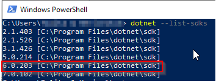
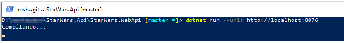
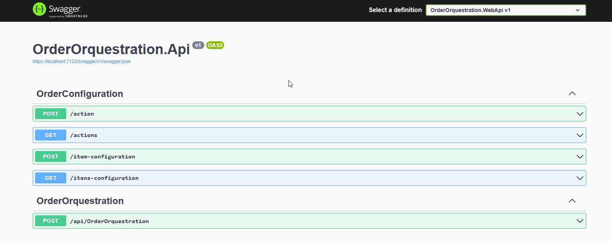
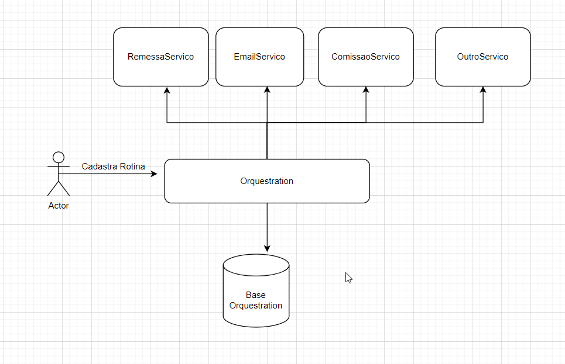
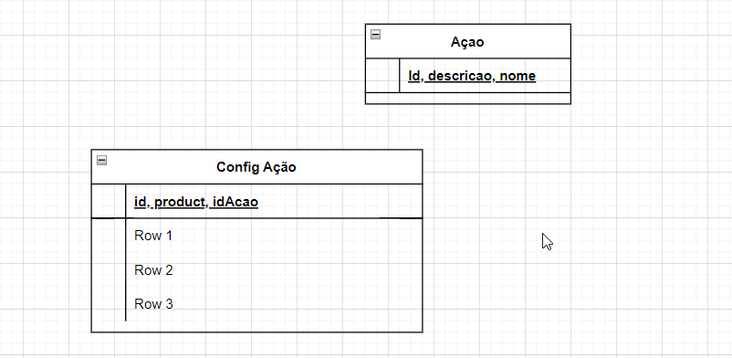

# OrderOrquestration.Api

Esta Api tem o propósito de fazer a orquestração das ações que devem ser realizadas após computado um pagamento de um determinado produto.

## Como executar?

Antes de mais nada, valide se você possui o SDK .Net 6 instalado em seu computador

- Abra o Windows PowerShell
- Execute o comando abaixo

` dotnet --list-sdks`

Caso não possua a versão _**6.x**_, você poderá obte-la pelo link oficial da Mirosofit [clicando aqui](https://dotnet.microsoft.com/en-us/download/dotnet/6.0)

- Vá até a pasta _**OrderOrquestration.WebApi**_ da aplicação no Windows PowerShell
- Execute o comando abaixo para iniciar a aplicação
  `dotnet run --urls http://localhost:8076`

Pronto! Agora é só acessar o link no browser de sua preferencia.
[http://localhost:8076/swagger](http://localhost:8076/swagger)

## Estrutura

### Base de dados

Foi utilizado o banco InMemory, um banco de dados simple que atende todos os requisitos propostos na aplicação. Foi utilizado o ORM Entityframework 6 para tratamento de todos os dados.

